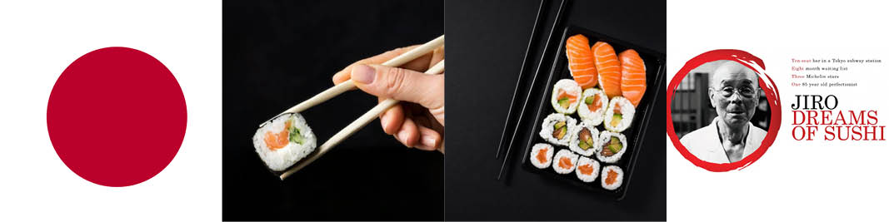

# Ghostbusters ESP Test Game

Live site: https://tberrigan2101.github.io/

## Project Introduction

For my fourth project I have developed a website for a Dublin Sushi restaurant I have named 'Umai' (loosely means 'tasty' in Japanese). I was originally planning to develop a music blog but on advice from my mentor about developing a restaurant booking system and having recently watched the documentary 'Jiro Dreams of Sushi' I believe this project could merge those two inspirations.

## 1. Features 

- __Theme and Colour Scheme__

  - I based the colour scheme on colours associated with Japan so it obviously needed to incorporate red and white into the branding. But I wanted to use colours that were more muted allowing for minimalist branding echoing the (deceptively) simple presentation of sushi and allowing images of the food to take focus. 
 

  

  
- __Site Layout__

  - The site was created using bootstrap to make things easy to build and edit. I was able to take cues from what had been demonstrated in previous walkthrough projects and use the modular approach of bootstrap to create minimalist, grid-orientated site. 
  
  A minimalist site navigation bar sites neatly at the top and a large 'Hero Image' appears directly below it on every page of the site to take away from the stark nature of the rest of the site.

  The index page displays the most content as it shows the six dishes that will be served during the 'sushi dining experience' to showcase the presentation skills of the chefs at Umai and to entice and educate would-be-diners.

 __Create an Account__

 - While it is possible to view some information without creating an account, creating an Umai account allows users to have more control over how they interact with the site. This feature was developed using AllAuth.

- __Reserve a Table__

  - This feature is to allow both site users and site admins to view and manage their bookings. In order to create a booking site users must register an account on the Umai site. This allows them to view, edit and delete their bookings with the following fields: 'Name', 'Date', 'Time', 'Email', 'Phone', 'Guests' and 'Message' to allow them to state any special requirements ahead of their booking. Once a booking has been submitted it is sent to the database where it can viewed, edited or deleted by the user on the front end or the admin on the back end. All user bookings are displayed on their unique reservation page so they can manage multiple bookings if they have them. This form is built using the MVT process using Django Models, Function Based Views, Templates and Crispy Forms for formatting.

- __Submit and Publish Reviews__

  - Users can submit reviews for approval via the 'Reviews' page but only registered, logged-in users are able to submit reviews which goes into a separate folder in the admin panel. Admins are then able to easily publish positive reviews directly to the Reviews page for all users to see. This form is again built using the MVT process using Django Models, Function Based Views, Templates and Crispy Forms for formatting.

- __Contact Form__

  - A simple contact form that anyone can use to get in touch with the restaurant. These submissions are again collected on the admin side in a specific folder for the admin to navigate. This form built using the MVT process but using class based views in this instance as I struggled to build the larger features with them. Crispy Forms is again used for formatting.

## 2. Future features

- I considered using a blog-like feature for the menu using the Django Blog walkthrough project as a reference. In the 'Jiro Dreams of Sushi' documentary it was mentioned that overfishing and price has an effect on supplies and what the chefs are able to produce. A blog based menu could allow the chefs to add, edit or delete dishes from the set menu easily if they have to.

## 3. Technology Used
- HTML
- CSS
- Javascript
- Bootstrap
- Django

## 4. Testing 

Below are my results from testing the site both structurally and visually.

### 4.1 Code Validation

- HTML
  - No errors were returned when passing through the official [W3C validator](https://validator.w3.org/nu/?doc=https%3A%2F%2Ftberrigan2101.github.io%2Fproject-two%2F)

- CSS
  - No errors were found when passing through the official [(Jigsaw) validator](https://jigsaw.w3.org/css-validator/validator?uri=https%3A%2F%2Ftberrigan2101.github.io%2Fproject-two%2F&profile=css3svg&usermedium=all&warning=1&vextwarning=&lang=en)

- Javascript
  - I passed my code through [JShint](/https://jshint.com/) and I got 21 warnings but when I discussed them with my mentor he said I shouldn't worry about them in the case of this project
    
  - I did get a note on an unused variable but whenever I tried to edit or remove this the game stopped working so I will need to revisit it again to understand what the reason might be.
    

### 4.2 User observations

- The people I tested the site with found the site easy to navigate and it felt relatively intuitive and the content made sense.

- One of the major issues that was flagged with me was I originally had text buttons for the game options and an image on the left showing the visuals of the icons and users thought this image was interactive so they bypassed the text buttons and clicked on the icon display graphic which wasn't an active button. After that I decided to remove the text buttons from the menu and just use the individual icons as buttons and replaced the player image on the left side wih the Ghostbusters graphic so users would understand what they had to select.

  

### 4.3 Bugs

   - I had initially designed an 'interval' function to the game where I wanted to replicate Dr. Venkman holding up a new card each time before the player makes their next guess and for this I created a function called 'resetGame'. This function would reset the player and computer images to their original state and would prompt the computer to speak another line from the movie that prepared the user to take another guess ('Clear your head','Nervous?' etc) so the user felt they were taking turns with a new card each time.

     
     

   - I set a timeout of 2 seconds for resetGame() in the playGame (playerChoice) function so each time the user made a choice the game would reset in two seconds but retain the scores. The correct responses were being generated from the string I createed but the buttons were still live and my mentor pointed out that it wasn't obvious that the player had to wait for the images to reset before taking their next turn and could keep making guesses potentially creating confusion.

   - We discussed different approaches such as trying to temporarily remove the Event Listener from the buttons, adding an overlay to the buttons so the player couldn't access them until the game reset and hiding the div that hid the buttons after each click. 

   - Unfortunately all of my attempts at trying to make this work failed and while I wanted to try and push the game further I felt it was better to remove the 'interval' feature completely as it didn't take anything away from the basic game functionality but leaving it in the game could cause problems for the user.

### 4.4 Supported Screens and Browsers

- I tested the site using Chrome, Safari and Firefox and all browsers tested fine.

### 4.5 Performance Testing

- Initial test for the site was good and there were a few small changes to be made, mostly image sizing that I compressed to the point where I thought they wouldn't be compromised. Following those changes I got these results from Lighthouse.

## 5. Deployment

- The site was deployed to GitHub pages. The steps to deploy are as follows: 
  - In the GitHub repository, navigate to the Settings tab 
  - From the source section drop-down menu, select the Master Branch
  - Once the master branch has been selected, the page will be automatically refreshed with a detailed ribbon display to indicate the successful deployment. 

The live link can be found here - https://tberrigan2101.github.io/project-two/

## 6. Credits 

In this section I will break down the credits for my project. 

### 6.1 Code

- I reused some of the bootstrap elements from the [Bootstrapping Your Next Big Idea With Bootstrap 4](https://learn.codeinstitute.net/courses/course-v1:CodeInstitute+BWB101+2021_T1/courseware/a2e690a737944c14afc3d6087ff1c3da/937785fc71da4c68b9978bb9695def4f/) example project from Code Institute.

- I rereused some of the html layout for the comments section from the [I Think Therefore I Blog](https://learn.codeinstitute.net/courses/course-v1:CodeInstitute+FST101+2021_T1/courseware/b31493372e764469823578613d11036b/fe4299adcd6743328183aab4e7ec5d13/) walkthrough project from Code Institute.

- I took inspiration for the booking feature by repurposing the approach of the ToDo app from the [Hello Django](https://learn.codeinstitute.net/courses/course-v1:CodeInstitute+FST101+2021_T1/courseware/dc049b343a9b474f8d75822c5fda1582/685f99dc7b6c41e497b402adbc97dfaa/?child=first) demonstration project from Code Institute.

- I repurposed a Bootstrap footer created by [MDBootstrap.com](https://mdbootstrap.com/snippets/standard/mdbootstrap/2885027?view=side).

### 6.2 Fonts

- All fonts were imported from [Google Fonts](https://fonts.google.com/about)

### 6.3 Written Content 

- While I edited or wrote the majority of the text, the sushi menu section contains repurposed text from [The 9 Most Common Types of Sushi, Explained](https://www.purewow.com/food/types-of-sushi).

### 6.4 Media

- Five of the menu images were taken from [The 9 Most Common Types of Sushi, Explained](https://www.purewow.com/food/types-of-sushi). One more was taken from [Sashimi | BBC Good Foodd](https://www.bbcgoodfood.com/glossary/sashimi-glossary).

- The images of the chefs and the hero images were taken from [Unsplash](https://unsplash.com/).

- The image I used to create the green smoke at the bottom of the page was taken from [here](https://www.pngitem.com/middle/TTJwT_grey-smoke-png-transparent-image-smoke-transparent-background/)

- The icons for the buttons were designed by me in Adobe Illustrator.

### 6.5 Acknowledgements

- I would like to thank my Code Institute mentor Rohit Sharma and a special thank you to Code Institute tutor Oisin who was a great help to me throughout my issues with this project.

