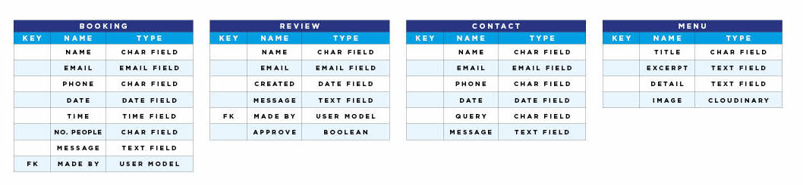

# UMAI Sushi Restaurant

Live site: https://tberrigan2101.github.io/

 

## Admin Details

 - User: admin
 - Password: umaipassword

## Project Introduction

For my fourth project I have developed a website for a Dublin Sushi restaurant I have named 'Umai' (loosely means 'tasty' in Japanese). I was originally planning to develop a music blog but on advice from my mentor about developing a restaurant booking system and having recently watched the documentary 'Jiro Dreams of Sushi' I believe this project could merge those two inspirations.

## 1. Initial Concepts 

- __Models__

  - These were my original models and as I started working with I decided to change them slightly as I became a little more familiar with Django models. I originally had an idea for a 'live menu' similar to a blog but as time went on I just wanted to get one model up and running that would give me CRUD options and that was the 'booking' feature. Following that a review system similar to the comments on a blog and I thought a contact form would be an obvious but useful feature and would be easier to build.
 

  

- __Wireframes__

  - I started thinking about how the views were going to display within the site. I did want the site to feel like a proper restaurant site and at times I probably became more interested in the UI and graphics than the functionality of the site. I had some initial sketches that I worked up in Adobe Illustrator but I realised that it was better to try and keep the layout as simple as possible and minimalist for easier building.
 

  

## 2. Features 

- __Theme and Colour Scheme__

  - I based the colour scheme on colours associated with Japan so it obviously needed to incorporate red and white into the branding. But I wanted to use colours that were more muted allowing for minimalist branding echoing the (deceptively) simple presentation of sushi and allowing images of the food to take focus. 
 

  

  
  
- __Site Layout__

  - The site was created using bootstrap to make things easy to build and edit. I was able to take cues from what had been demonstrated in previous walkthrough projects and use the modular approach of bootstrap to create minimalist, grid-orientated site that was also mobile-friendly. 
  
  - A minimalist site navigation bar sites neatly at the top and a large 'Hero Image' appears directly below it on every page of the site to take away from the stark nature of the rest of the site.

  - The index page displays the most content as it shows the six dishes that will be served during the 'sushi dining experience' to showcase the presentation skills of the chefs at Umai and to entice and educate would-be-diners.

 __Create an Account__

 - While it is possible to view some information without creating an account, creating an Umai account allows users to have more control over how they interact with the site. This feature was developed using AllAuth.

- __Reserve a Table__

  - This feature is to allow both site users and site admins to view and manage their bookings. In order to create a booking site users must register an account on the Umai site. This allows them to view, edit and delete their bookings with the following fields: 'Name', 'Date', 'Time', 'Email', 'Phone', 'Guests' and 'Message' to allow them to state any special requirements ahead of their booking. Once a booking has been submitted it is sent to the database where it can viewed, edited or deleted by the user on the front end or the admin on the back end. All user bookings are displayed on their unique reservation page so they can manage multiple bookings if they have them. This form is built using the MVT process using Django Models, Function Based Views, Templates and Crispy Forms for formatting.

- __Submit and Publish Reviews__

  - Users can submit reviews for approval via the 'Reviews' page but only registered, logged-in users are able to submit reviews which goes into a separate folder in the admin panel. Admins are then able to easily publish positive reviews directly to the Reviews page for all users to see. This form is again built using the MVT process using Django Models, Function Based Views, Templates and Crispy Forms for formatting.

- __Contact Form__

  - A simple contact form that anyone can use to get in touch with the restaurant. These submissions are again collected on the admin side in a specific folder for the admin to navigate. This form built using the MVT process but using class based views in this instance as I struggled to build the larger features with them. Crispy Forms is again used for formatting.

## 3. Future features

- I considered using a blog-like feature for the menu using the Django Blog walkthrough project as a reference. In the 'Jiro Dreams of Sushi' documentary it was mentioned that overfishing and price has an effect on supplies and what the chefs are able to produce. A blog based menu could allow the chefs to add, edit or delete dishes from the set menu easily if they have to.

- I would prefer to have the reviews and the option to leave a review on one page like the walkthrough blog project as going through two pages seems a bit clunky in terms of user experience. I know that this can only using class based views and I struggled to get me head around how they worked which is why the feature ended up the way it did using fucntion based views across two pages.

- I would like to create a more robust reservation feature allowing users and admins to see conflicts with scheduling or restaurant capacity. This was noted by my mentor but I wasn't able to create something that worked. I looked at other examples of booking systems using Django and Python but they were either as simple or too complex for me to replicate without copying it and try to make it work within my framework.

## 4. Technology Used
- HTML
- CSS
- Javascript
- Bootstrap
- Python
- Django
- Relational Databasex

## 5. Testing 

Below are my results from testing the site both structurally and visually.

### 5.1 Code Validation

- HTML
  - There was one error and two warnings when passing through the official [W3C validator](https://validator.w3.org/nu/?doc=https%3A%2F%2F8000-tberrigan21-p4restauran-rib48rln8y7.ws-eu104.gitpod.io%2F) but I was able to clear a lot of the earlier problems between the index and base html files.There was a stray end tag which I could not find after indenting the index code and I assuming it is within the bootstrap footer template I used. The warnings were also in the footer but I didn't want to risk altering it too much.

 

- CSS
  - No errors were found when passing through the official [(Jigsaw) validator](https://jigsaw.w3.org/css-validator/validator?uri=https%3A%2F%2F8000-tberrigan21-p4restauran-rib48rln8y7.ws-eu104.gitpod.io%2F&profile=css3svg&usermedium=all&warning=1&vextwarning=&lang=en)

### 5.2 User observations

- The people I tested the site with found the site easy to use and navigate. Two comments that were made was that the site seemed a bit thin on pages and that the site could expand to give more information or a story about the restaurant.  They also felt that the reviews could be more than just text and made comparisons to Google reviews where people can add photos or comments could be replied to by admin.

### 5.3 Bugs

   - I don't have any issues as far as I can tell.

### 5.4 Supported Screens and Browsers

- I tested the site using Chrome, Safari and Firefox and all browsers tested fine.

### 5.5 Performance Testing

- Initial test for the site was fair and there were a few small changes to be made, mostly image sizing that I compressed to the point where I thought they wouldn't be compromised. Following those changes I got these results from Lighthouse. What dragged the performance results down was Bootstrap loading and this is something that I will need to educate myself about more to make sites using bootstrap and django run as efficiently as possible. I also tried to improve the accessibility score by altering the colour contrast on the site but it didn't improve, again the issues seemed to be built in to the various add ons I was using which I don't fully understand.

## 6. Deployment

- The site was deployed ---

## 7. Credits 

In this section I will break down the credits for my project. 

### 7.1 Code

- I reused some of the bootstrap elements from the [Bootstrapping Your Next Big Idea With Bootstrap 4](https://learn.codeinstitute.net/courses/course-v1:CodeInstitute+BWB101+2021_T1/courseware/a2e690a737944c14afc3d6087ff1c3da/937785fc71da4c68b9978bb9695def4f/) example project from Code Institute.

- I rereused some of the html layout for the comments section from the [I Think Therefore I Blog](https://learn.codeinstitute.net/courses/course-v1:CodeInstitute+FST101+2021_T1/courseware/b31493372e764469823578613d11036b/fe4299adcd6743328183aab4e7ec5d13/) walkthrough project from Code Institute.

- I took inspiration for the booking feature by repurposing the approach of the ToDo app from the [Hello Django](https://learn.codeinstitute.net/courses/course-v1:CodeInstitute+FST101+2021_T1/courseware/dc049b343a9b474f8d75822c5fda1582/685f99dc7b6c41e497b402adbc97dfaa/?child=first) demonstration project from Code Institute.

- I repurposed a Bootstrap footer created by [MDBootstrap.com](https://mdbootstrap.com/snippets/standard/mdbootstrap/2885027?view=side).

### 7.2 Fonts

- All fonts were imported from [Google Fonts](https://fonts.google.com/about)

### 7.3 Written Content 

- While I edited or wrote the majority of the text, the sushi menu section contains repurposed text from [The 9 Most Common Types of Sushi, Explained](https://www.purewow.com/food/types-of-sushi).

### 7.4 Media

- Five of the menu images were taken from [The 9 Most Common Types of Sushi, Explained](https://www.purewow.com/food/types-of-sushi). One more was taken from [Sashimi | BBC Good Foodd](https://www.bbcgoodfood.com/glossary/sashimi-glossary).

- The images of the chefs and the hero images were taken from [Unsplash](https://unsplash.com/).

### 7.5 Acknowledgements

- I would like to thank my Code Institute mentor Rohit Sharma and a special thank you to Code Institute tutor Oisin who was a great help to me throughout my issues with this project.

